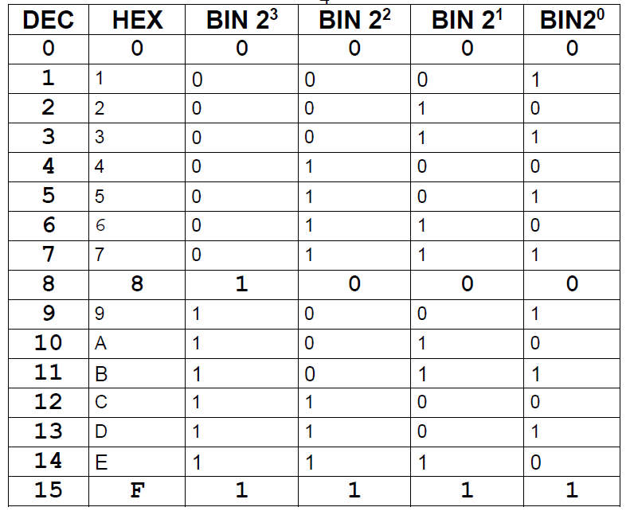

# Lösung zu DATEN_CODIEREN_AUFGABEN

### 1. Tabelle mit Dezimal-, Hexadezimal- und Binärzahlen

### 2. Dezimalzahl 911 in Binär

1110001111

### 3. Binärzahl 1011'0110 in Dezimal

182

### 4. Binärzahl 1110'0010'1010'0101 in Hexadezimal

E2A5

> Beim ausrechnen:
> 0 + 0 = 0, 0 + 1 = 1, 1 + 0 = 1, and 1 + 1 = 10.

### 5. Addition der binären Zahlen 1101'1001 und 0111'0101

Ergebnis in 8 Bit: 01001110

### 6. Bedeutung der binären Werte

a. Dezimal: 192.168.76.211, Hexadezimal: C0.A8.4C.D3  
b. Dezimal: 190.131.133.213.228.254, Hexadezimal: BE.83.85.D5.E4.FE

### 8. Codebreite des Binärcodes für Kabinenzählung

2^7 = 7 Bits

das nächste Zahle, der nach 107 ist, würde 128 sein.

### 11. Umwandlung und Operationen mit vorzeichenbehafteten und vorzeichenlosen Ganzzahlen

> Datentyp "unsigned integer": positive numerische Werte.
> Datentyp "signed integer": negative und positive numerische Werte.

<b> a. kleinster und grösster Binärwert bzw. Dezimaläquivalent im Falle von unsigned bzw. Vorzeichenlos. </b>
In Dezimal:

`0 - 255`

<b>b. Kleinster und größter Binärwert bzw. Dezimaläquivalent (signed)</b>
In Dezimal:

`-128 - 127`

<b>c. Dezimalzahl +83 in vorzeichenbehafteten Binärwert (signed) </b>
In Binärwert:

`0101 0011`

<b>d. Dezimalzahl -83 in vorzeichenbehafteten Binärwert (signed mit 2er-Komplement) </b>
In Binärwert:

`1010 1101`

> Man invertiert das Positive ins Negative:`0101 0011` -> `1010 1100`
> Negative Werte haben immer eine 1 als erste Binärzahl: XXXX XXX1 -> `1010 1101`

<b>e. Addition der beiden erhaltenen Binärwerte </b>

`100000000` und in 8 Bits: `0000 0000`

<b>f. Dezimalzahl 0 in einen vorzeichenbehafteten Binärwert umwandeln (signed) </b>

Binärwert: `00000000`

Ja, in 8 Bit ist es dasselbe.

<b>g. Warum können sie bei der gegebenen Datenbusbreite von 1 Byte die Dezimalzahl +150 nicht in einen vorzeichenbehafteten Binärwert umwandeln? </b>
Die Zahl +150 überschreitet den maximal möglichen positiven Wert (+127) in einem 8-Bit vorzeichenbehafteten System. Deshalb kann +150 nicht korrekt in einem Byte dargestellt werden, wenn es als vorzeichenbehaftete Ganzzahl interpretiert wird.

### 12. Fliesskommazahlen

Manchmal werden Bruch- oder Dezimalwerte als ganze Zahlen dargestellt. Für solche Fälle sind, sind Fliesskommazahlen die richtige Wahl.

Normalerweise würde ein int von 0.3333333 so aussehen: 0, aber dank float sieht es als ihre aktuelle Form.

## Aufgaben zu alphanumerischen Codes

### Welche der Dateien ist nun ASCII-codiert, welche UTF-8 und welche UTF-16 BE-BOM?

- Textsample1: ASCII
- Textsample2: UTF-8
- Textsample3: UTF-16 BE-BOM

### Alle drei Dateien enthalten denselben Text. Aus wie vielen Zeichen besteht dieser?

68 Zeichen

### Dateigrössen?

- Textsample1: 68 Bytes
- Textsample2: 71 Bytes
- Textsample3: 138 Bytes

### ASCII- und die UTF-8-Datei

- Umlaut: ä
- Eurozeichen: €

### Big-Endian (BE), Little-Endian (LE) in UTF-16

- Big-Endian: Byte-Reihenfolge wie hh:mm:ss
- Little-Endian: Byte-Reihenfolge wie dd:mm:yyyy

### Änderungen?

Durch das Abwechseln der Encoding von ASCII zu UTF abwechselt, werden die Zeichen der Texten angepasst
